[English](./README.md) | 简体中文

## 💎 项目介绍

项目地址: [GitHub](https://github.com/HurTeng/ErrorCode)

当你开始学习一门新语言时, 一般会做什么? 写一个 ***Hello World*** 并打印出来?
相信这一幕大家都熟悉, 但光打印一个简单的 ***Hello World***, 能让你快速学习一种新语言吗? 答案是否定的.

编程语言都是相似的, 只是语法存在差异, 但编程的重点在于代码的逻辑实现以及算法.
所以, 学习一种新的语言, 需要结合实际编码, 通过实现一个程序功能, 能让你熟悉该编程语言的语法, 使你快速掌握这门语言.

在这个项目中, 我分别使用Java, Kotlin, JavaScript, Python, Dart, Go这几种语言, 实现了一个csv文本生成对应语言代码的小程序.

## ✨ 功能说明

这是一个读取文本并生成代码的小程序,它的功能如下:

- 读取一个csv的文本
- 逐行解析其中的数据
- 提取并分割每一行的内容,生成元数据
- 将这些数据生成对应的语言的常量类以及枚举类代码.

csv文本的内容:

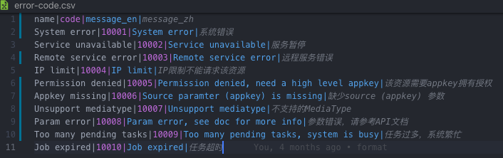
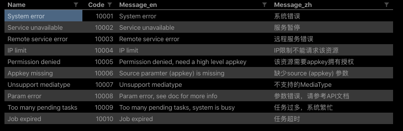

生成的文件:

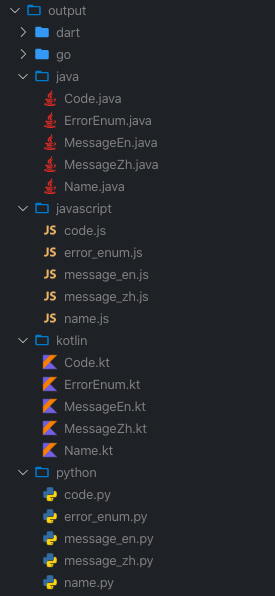

生成的代码:

- Java

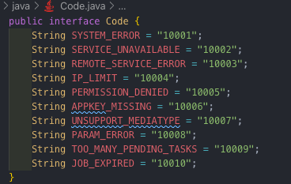
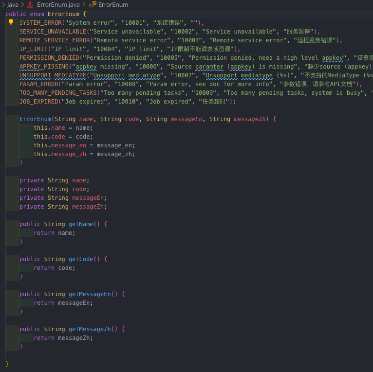

- JavaScript

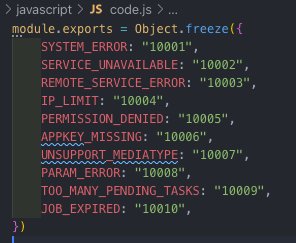

- Kotlin

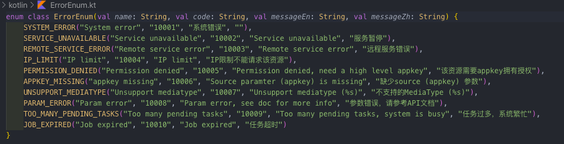

- Python

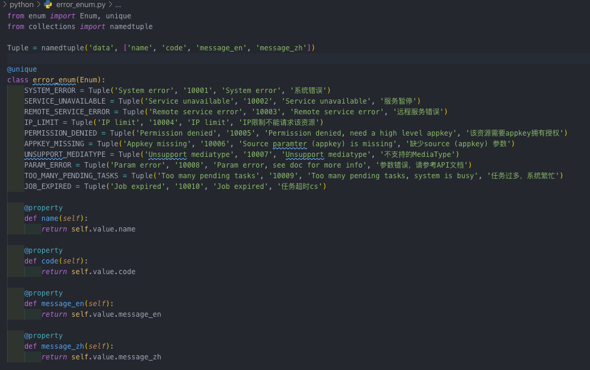

- Dart

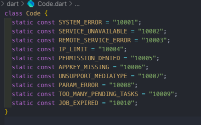

- Go

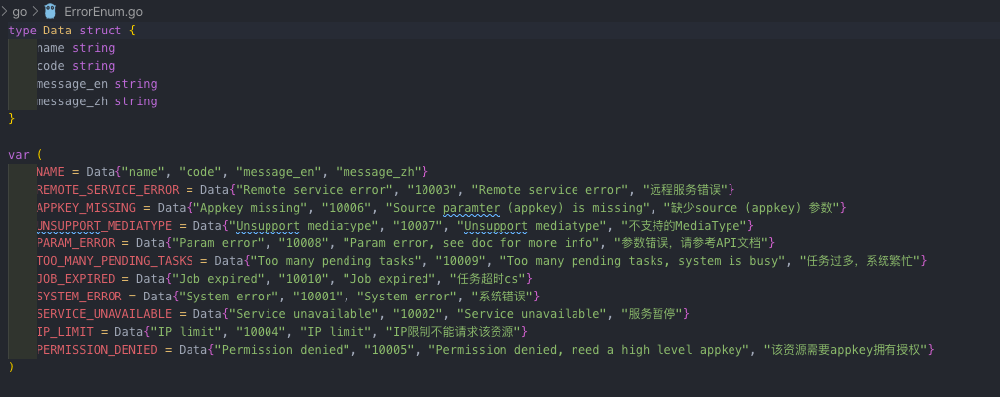

## 🔑 实现原理

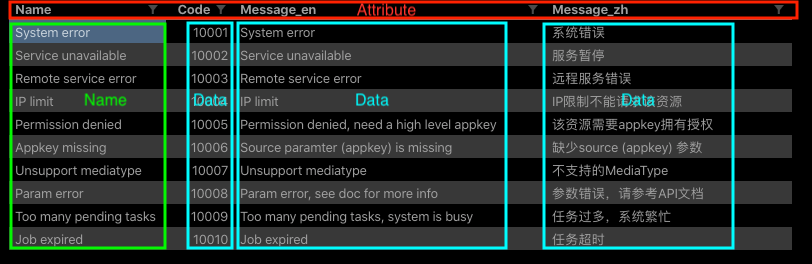

表格里面的是二维数据, 按行跟列来组织数据.

- 第一行是标题行, 里面的单元格代表着相关的属性
- 第一列是索引列, 里面的单元格代表着相关的名称
- 表格的每一行代表着一组数据(可以理解为一个对象,每个单元格代表着该对象的相关属性)

根据以上的规则解析出数据后, 我们就可以通过字符模板生成相应的常量类以及枚举类.

## 📖 知识梳理

这里面涉及的知识有:

- 文件的读写
- 异步编程
- 异常处理
- 字符串处理
- 正则表达式
- 逻辑的控制流
- 类, 变量, 方法函数的定义
- 变量的作用域
- 基本数据类型
- 集合(数组, 列表, 映射)
- 集合的遍历
- 可选参数和默认参数
- 枚举
- 结构体

## ❤️ 特别说明

这个程序功能虽然简单, 但这里面涵盖了一系列基本的编程语言知识点, 通过它你可以快速地学习并掌握一门新语言.
不需要再写简单的 ***Hello World***, 尝试着用代码完成这个小程序吧, 当你实现了这个小程序, 你会发现掌握一门语言并非想象中的那么难.

本项目仅仅是抛砖引玉, 方便大家参考, 如果发现代码写得不好的地方, 或者有其他新的语言实现, 欢迎提PR贡献代码.
希望大家能从这个项目中学到有用的东西, 如果喜欢这个项目可以点个 ⭐️️ **Star** 收藏哦
